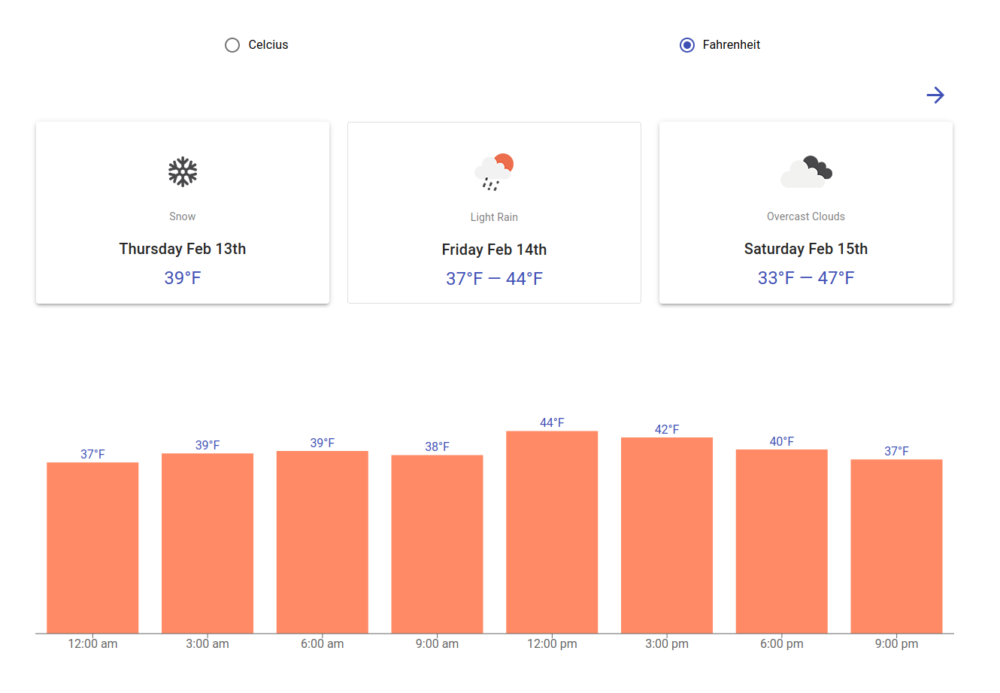

# Weather App

[Start Weather App](https://igorisonfire.github.io/weather-app/#/)



## Getting Started

These instructions will get you a copy of the project up and running on your local machine for development and testing purposes. See deployment for notes on how to deploy the project on a live system.

### Prerequisites

For running this application you need to have [NodeJs](https://nodejs.org/en/) and [NPM](https://www.npmjs.com/).
We recommend to use [NVM](https://github.com/creationix/nvm) for managing NodeJs versions
For NVM installation please refer to [manual](https://github.com/creationix/nvm#install--update-script)

### Installing

```
npm install
```

### Run application

```
npm run start
```

If you need to compile application for deployment

```
npm run build
```

## Built With

* [React.js](https://github.com/facebook/react/) - Component Library
* [TypeScript](https://www.typescriptlang.org/) - Primary language
* [Redux](https://github.com/reduxjs/react-redux) - State management library